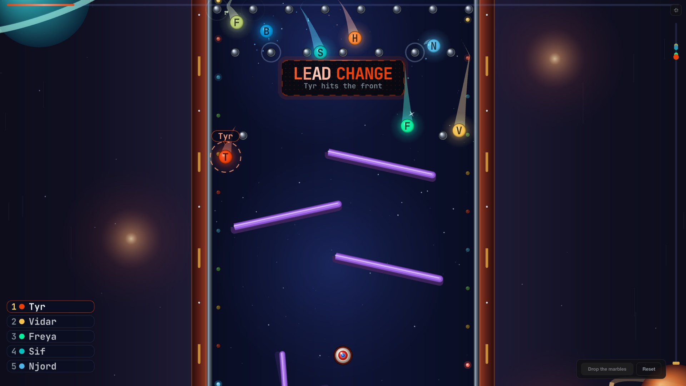

[](LICENSE)
[](https://en.wikipedia.org/wiki/Thor_Vector_Graphics)
[](https://discord.gg/n25xj6J6HM)
[](https://opencollective.com/thorvg)

# Thor Marble Race



**"Drop the Marbles, Let Fate Roll!"**

Somebody has to buy the coffee, take the next ticket or win the raffle, and nobody trusts a coin flip anymore. So the names go on marbles, the marbles go on the board, and the board decides.  

  

Powered by ThorVG, this demo showcases real-time vector rendering, physics-driven animation and interactive gameplay in the browser.
  


## Build & Run

Requires Node.js 20 or later and Yarn.

```
$ yarn install
$ yarn dev        # dev server on :3003
$ yarn build      # production build
$ yarn start      # serve the production build
$ yarn lint
```

Select the rendering backend with `?renderer=<engine>`. The default is `gl`:

```
http://localhost:3003/?renderer=gl  # WebGL
http://localhost:3003/?renderer=wg  # WebGPU
http://localhost:3003/?renderer=sw  # CPU (Software)
```


### URL params

- `?names=Thor,Odin,Freya` — runners, up to 20
- `?renderer=sw|gl|wg` — Software, WebGL, WebGPU (default `gl`).


### Environment

- `NEXT_PUBLIC_SITE_URL` — pins the host in link preview tags. Without it, read off the request.


## Authors

- **[Jinny You](https://github.com/tinyjin)**
- **Claude Code (Claude Opus 5.5)**

